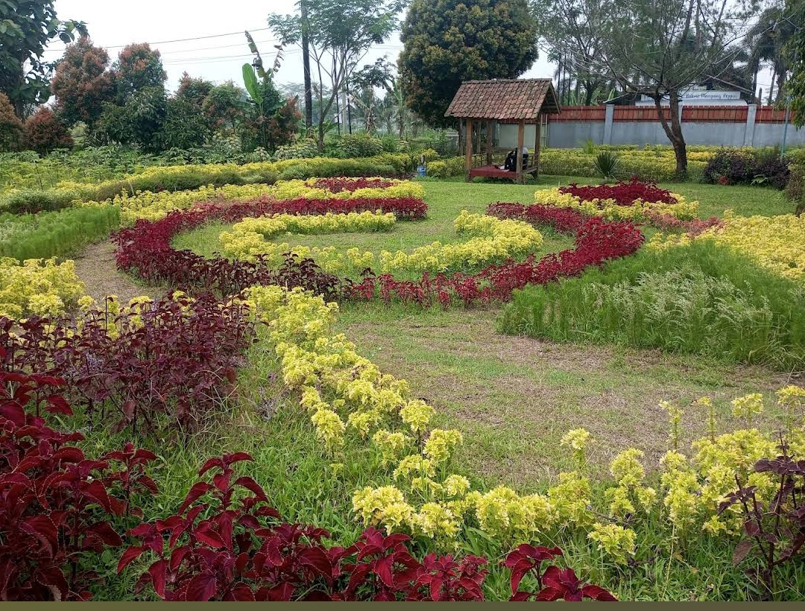
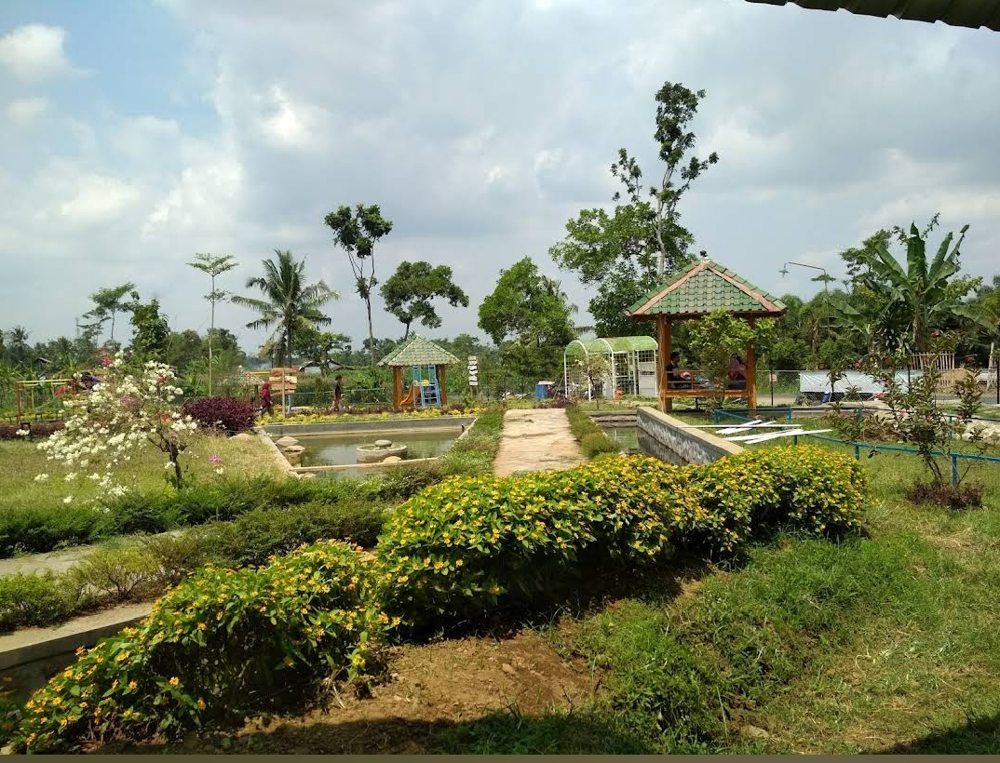
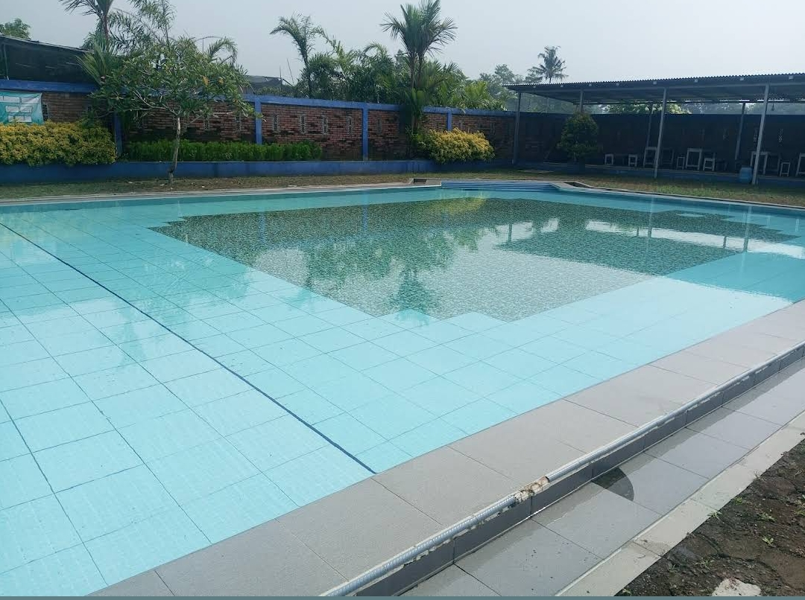

<!DOCTYPE html>
<html lang="id">
<head>
    <meta charset="UTF-8">
    <meta name="viewport" content="width=device-width, initial-scale=1.0">
    <title>Biodata dan Daftar Riwayat Hidup</title>
    <link rel="stylesheet" href="https://stackpath.bootstrapcdn.com/bootstrap/4.5.2/css/bootstrap.min.css">
</head>
<body>
    <nav class="navbar navbar-expand-lg navbar-light bg-light">
        

           
            <button class="navbar-toggler" type="button" data-toggle="collapse" data-target="#navbarNav" aria-controls="navbarNav" aria-expanded="false" aria-label="Toggle navigation">
              
            </button>
            

              <ul class="navbar-nav">
                <li class="nav-item active">
                  <a class="nav-link" href="index.html">Beranda (current)</a>
                </li>
                <li class="nav-item">
                  <a class="nav-link" href="profil.html">Profil</a>
                </li>
                <li class="nav-item">
                  <a class="nav-link" href="layanan.html">Layanan</a>
                </li>
                <li class="nav-item">
                    <a class="nav-link" href="galeri.html">Galeri</a>
                  </li>
                  <li class="nav-item">
                    <a class="nav-link" href="kontak.html">Kontak</a>
                  </li>
              </ul>
            

        

       
      </nav>
    
        <!-- Jumbotron -->

    

        <h1 class="display-4">Selamat Datang di Taman Lazuardi Susukan</h1>
        
Temukan Keindahan Destinasi Terbaik di Susukan, Kecamatan Sumbang, Banyumas

        <a href="#" class="btn btn-light btn-lg">Jelajahi Sekarang</a>
    

<!-- Features Destinations -->

    <h2 class="mb-4">Destinasi Favorit</h2>
    

        

            

                
                

                    <h5 class="card-title">Taman Bunga</h5>
                    
Beragam Jenis Bunga yang Indah.

                    
                

            

        

        

            

                
                

                    <h5 class="card-title">Gazebo</h5>
                    
Nikmati Keindahan Taman dengan Duduk di Gazebo.

                  
                

            

        

        

            

                
                

                    <h5 class="card-title">Kolam Renang</h5>
                    
Menyegarkan Badan dengan Berenang.

                

            

        

    

      
        
        <footer class="text-center mt-4">
            
&copy; 2024 . Muhamad Tafsirul Mizan. STI202303390.

        </footer>
    

    
    
    
</body>
</html>
